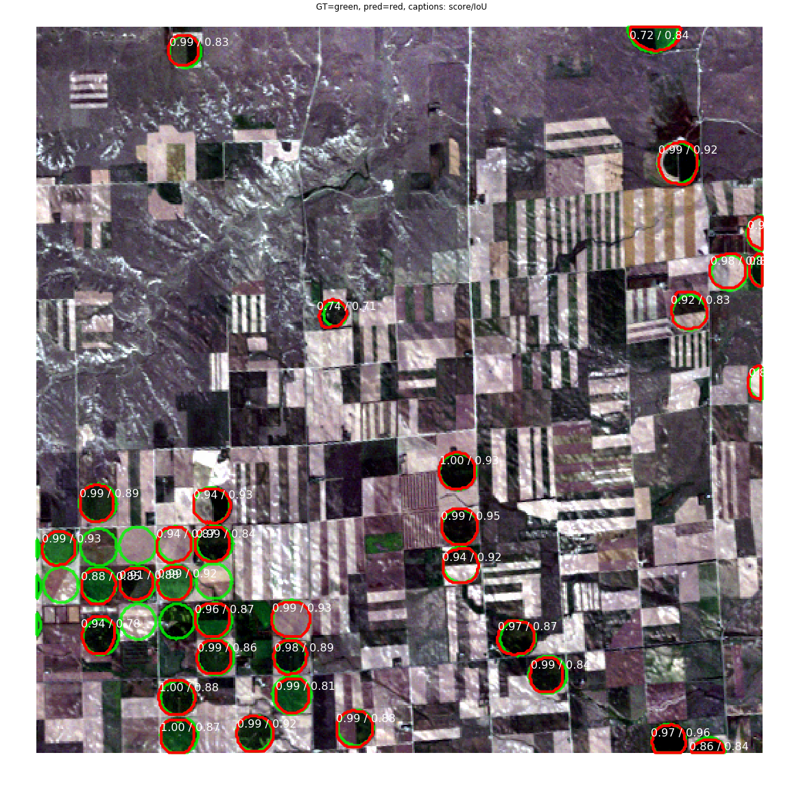

[](https://github.com/ambv/black)

CropMask is a project to train and deploy instance segmentation models for mapping center pivot agriculture from multispectral satellite imagery. It extends [matterport's module](https://github.com/matterport/Mask_RCNN) , which is an implementation of [Mask R-CNN](https://arxiv.org/abs/1703.06870) on Python 3, Keras, and TensorFlow. CropMask work with multispectral satellite imagery, contains infrastructure-as-code via terraform to provision a testing cluster on Azure, and will eventually contain a Leaflet or OpenLayers web app to expose maps of crop water use in drylands across the globe. 

See [matterport's module](https://github.com/matterport/Mask_RCNN)for an explanation of the Mask R-CNN architecture and a general guide to notebook tutorials and notebooks for inspecting model inputs and outputs.

For an overview of the project in poster form, see this poster I presented at the Fall 2018 Meeting on [Center Pivot Crop Water Use](assets/cropmask_agu2018.pdf). 

Below are Preliminary results from test on 2004 Landsat SR scene over western Nebraska. Detections are in Red, Targets from the Nebraska Department of Agriculture are in Green. Metrics are (probability score)/(intersection over union)


## Local Installation of cropmask dependencies, see `terraform/` folder for instructions to set up azure components.
1. Install dependencies and install the package
   ```bash
   conda env create -f cropmask-env.yml
   python setup.py install # use develop instead of install for editable mode
   ```
2. Create a file called `.lsru` at `~` and fill in your NASA Earth Explorer Login credentials
   ```
   [usgs]
   username=
   password=
   ```
3. Copy the `azure_configs_template.yaml`, name it `azure_configs.yaml` and place it outside of the git repository (so you don't accidently commit it). Fill it in according to the comments int he template.
3. Download pre-trained COCO weights (mask_rcnn_coco.h5) from the [releases page](https://github.com/matterport/Mask_RCNN/releases).
4. (Optional) To train or test on MS COCO install `pycocotools` from one of these repos. They are forks of the original pycocotools with fixes for Python3 and Windows (the official repo doesn't seem to be active anymore).

    * Linux: https://github.com/waleedka/coco
    * Windows: https://github.com/philferriere/cocoapi.
    You must have the Visual C++ 2015 build tools on your path (see the repo for additional details)

### This setup will allow you to run the parts of the project that don't require Azure, like locally downloading Landsat products according to watershed boundaries. For instructions on setting up the entire project on Azure, see the README in the terraform folder
